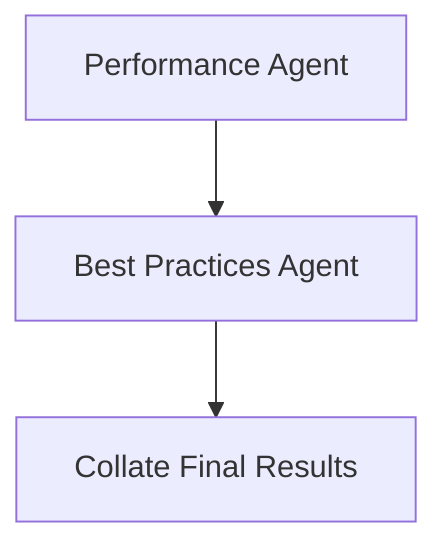

# Best Practices Agent: Planning Document

## Objective

Design and implement a **language-agnostic** AI agent ("Best Practices Agent") that reviews code changes for adherence to maintainability, readability, and idiomatic development standards. This agent focuses on long-term code quality improvements that go beyond immediate correctness or performance.

---

## LangGraph Node Flow



---

## Agent Inputs

Each file node will include:

- `diff`: GitHub-style patch of changed lines
- `full_text`: Entire file content
- `language`: Programming language (used to frame prompt examples)
- `lint_issues`, `bug_issues`, `perf_issues`: Used for cross-reference and avoiding duplication

---

## Best Practices Detection Strategy

### 1. Scope

The agent evaluates code for the following:

- Clarity and readability (e.g., descriptive naming, logical structuring)
- Proper use of idioms and language conventions
- Maintainability (e.g., modular functions, small scope, minimal duplication)
- Documentation presence (function/class docstrings, comments)
- Clean separation of concerns
- Testability and cohesion
- Avoiding premature optimization or overengineering

### 2. LLM-Based Review

This step uses an LLM to:

- Focus exclusively on **maintainability and best practices**
- Suggest structural or idiomatic improvements
- Ignore style, performance, and bug reports already covered

---

## Agent Output Schema (Per File)

```json
{
  "best_practice_issues": [
    {
      "line": 12,
      "type": "best_practice",
      "description": "Function is too long and difficult to test",
      "suggestion": "Break the function into smaller, reusable components",
      "code_suggestion": "Refactor logic into helper functions for clarity and reuse"
    }
  ]
}
```

---

## Design Notes

- Fully LLM-based; no heuristics in MVP
- Prompt explicitly instructed to avoid repeating style/bug/perf suggestions
- Structured output includes both natural language and code-level refactor suggestions
- Easily extensible in future to enforce company-specific best practices or patterns

---

## Next Steps

- Draft prompt template for best practices review
- Implement `best_practice_agent_node` in LangGraph
- Connect this node after the Performance Agent
- Final step: merge results from all agents into a collated response

