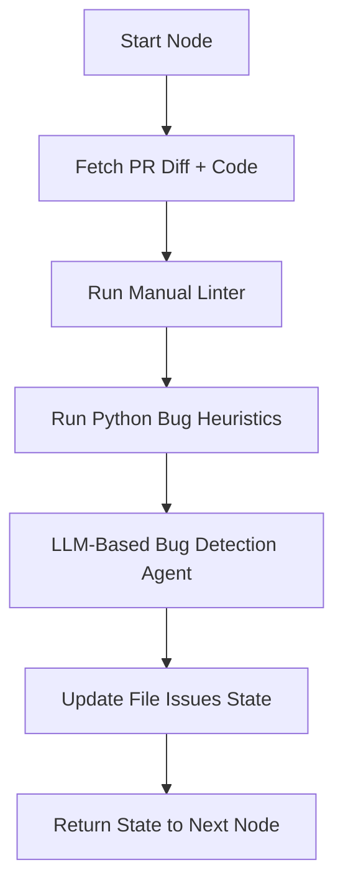

# Bug Detection Agent: Planning Document

## Objective

Design and implement a specialized AI agent ("Bug Agent") that focuses exclusively on detecting potential bugs in GitHub pull request diffs using a combination of static heuristics and LLM-based review.

---

## LangGraph Node Flow



---

## Agent Inputs

Each file node will include the following data:

- `diff`: Changed lines in the PR
- `full_text`: Entire file content for context
- `lint_issues`: Style issues detected earlier
- `language`: Language of the file (used for routing heuristics)

---

## Bug Detection Strategy

### 1. Static Heuristic Check (Python-First)

Basic rule-based logic to identify common bug patterns, e.g.:

- Dictionary key access without `.get()`
- File operations without `with` block
- Division operations that may involve zero
- Attribute access without null-checks

This step provides quick, explainable, and high-confidence insights.

### 2. LLM-Based Review

Leverages an LLM agent that:

- Receives the diff, full file, lint issues, and heuristic findings
- Focuses only on potential **bugs** and **logic errors**
- Ignores style, formatting, and performance issues

---

## Agent Output Schema (Per File)

```json
{
  "lint_issues": [...],
  "bug_heuristics": [...],
  "bug_issues": [...]
}
```

---

## Design Notes

- Python is the first supported language
- The heuristics system is modular and allows for future expansion to JavaScript, Go, Rust
- LLM agent prompt is narrowly scoped to avoid style overlaps
- Issues from heuristics are passed into the LLM as input context, not as output

---

## Next Steps

- Implement `python` heuristic module
- Integrate bug agent as a LangGraph node
- Later: expand support to other languages

