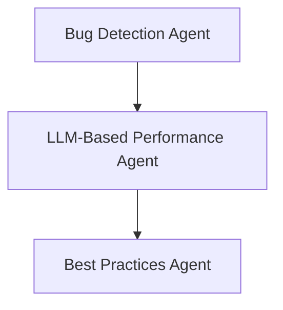

# Performance Review Agent: Planning Document

## Objective

Design and implement a specialized, **language-agnostic** AI agent ("Performance Agent") that detects potential performance issues in code changes submitted via GitHub pull requests. This agent complements bug and style checkers by focusing purely on optimization opportunities and efficiency concerns using LLM-based review.

---

## LangGraph Node Flow



---

## Agent Inputs

Each file node will include:

- `diff`: GitHub-style patch of changed lines
- `full_text`: Complete file content for broader context
- `language`: Programming language of the file (used only to contextualize the prompt)
- `lint_issues`, `bug_issues`: Used for reference to avoid duplication

---

## Performance Detection Strategy

### 1. Scope

The agent focuses exclusively on performance-related issues, such as:

- Unnecessary nested loops or recomputation
- Inefficient algorithms or data structures
- Repeated I/O operations
- Lack of memoization or caching
- Large object cloning or copying
- Poor use of async/concurrency primitives
- N+1 query patterns (in DB-heavy files)

### 2. LLM-Based Review Only

This step uses an LLM to:

- Examine the diff and full context
- Surface only performance optimization opportunities
- Ignore bugs and style issues
- Reason across languages using general programming patterns

There are **no heuristics or language-specific rules** in this phase.

---

## Agent Output Schema (Per File)

```json
{
  "perf_issues": [
    {
      "line": 34,
      "type": "performance",
      "description": "Unnecessary list traversal in nested loop",
      "suggestion": "Consider using a set for O(1) lookup",
      "code_suggestion": "if item in lookup_set: ..."
    }
  ]
}
```

---

## Design Notes

- Fully language-agnostic via prompt engineering
- Prompts may vary slightly depending on `language` to improve LLM accuracy
- No static analysis or heuristics for MVP
- Output includes concrete `code_suggestion` snippets where applicable
- Output is merged with prior agent results for final collated output
- Token usage is minimized by reusing parsed state (e.g., same `full_text` from bug agent)

---

## Next Steps

- Write prompt template for performance detection
- Implement `performance_agent_node` in LangGraph
- Integrate node after Bug Agent and before Best Practices Agent
- Later (optional): add heuristics per language for deeper static analysis

